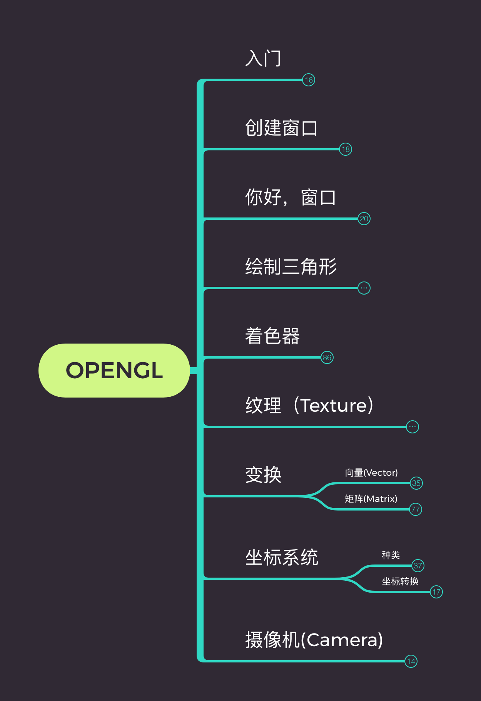
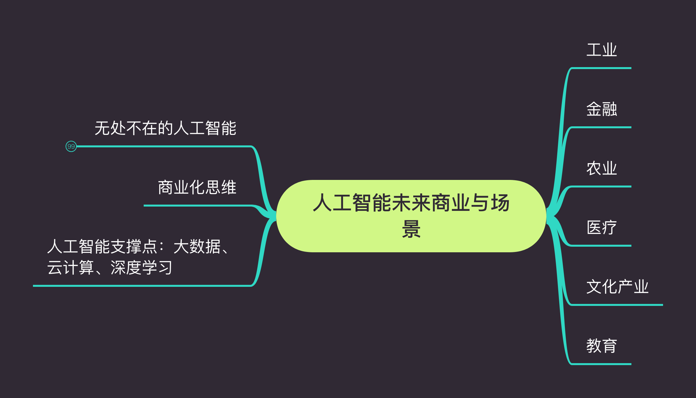
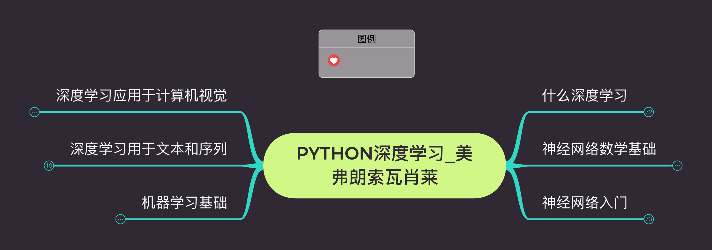

# BooksMind

对已阅读的书籍或教程，输出Xmind进行总结。

- [BooksMind](#booksmind)
  - [计算机](#计算机)
    - [计算机基础](#计算机基础)
    - [图像处理](#图像处理)
    - [AI](#ai)

## 计算机

### 计算机基础

### 图像处理

1. [OpenGL](https://github.com/lllhhh/BooksMind/blob/main/计算机/图像处理/OpenGL/OpenGL.xmind) 

### AI

1. [人工智能-未来商业与场景落地](https://github.com/lllhhh/BooksMind/blob/main/计算机/AI/人工智能-未来商业与场景落地/人工智能-未来商业与场景落地.xmind) 
2. [Python深度学习](https://github.com/lllhhh/BooksMind/blob/main/计算机/AI/Python深度学习/Python深度学习___美弗朗索瓦肖莱.xmind) 

## 投资理财

1. [35岁前要上的33堂理财课](https://github.com/lllhhh/BooksMind/blob/main/投资/35岁前要上的33堂理财课/35岁前要上的33堂理财课.xmind)

   

